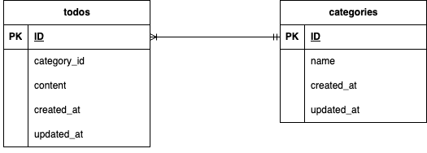

# 📬 todo- Laravel Application

このアプリケーションは、Laravel を使用して構築されたtodoアプリです

## 🔧 使用技術（Tech Stack）
- **Laravel** 8.83.8
- **PHP** 8.1（Dockerコンテナ内）
- **Composer** 2.x
- **MySQL** 8.0
- **Docker**（環境構築用：nginx, php, mysql）
- **phpMyAdmin**（http://localhost:8080 でDB操作可能）

## 📦 環境構築手順（Setup）

```
cd coachtech/laravel
git clone git@github.com:Estra-Coachtech/laravel-docker-template.git
mv laravel-docker-template  todo

docker-compose up -d --build
docker-compose exec php bash
composer install
```

### 🔧 .envファイルの作成と設定
```
cp .env.example .env
```
.env ファイルには以下のように設定します
```env
DB_CONNECTION=mysql
DB_HOST=mysql
DB_PORT=3306
DB_DATABASE=laravel_db
DB_USERNAME=laravel_user
DB_PASSWORD=laravel_pass
```

### 🧩 データベースマイグレーション（Migration）
下記コマンドでマイグレーションを実行し、データベースにテーブルを作成します
```
docker-compose exec php php artisan migrate
```

### 🔑 アプリケーションキーの生成
アプリケーションキーを生成し .env に自動設定します：
```
docker-compose exec php php artisan key:generate
```

### 🗺 ER図（Entity Relationship Diagram）

